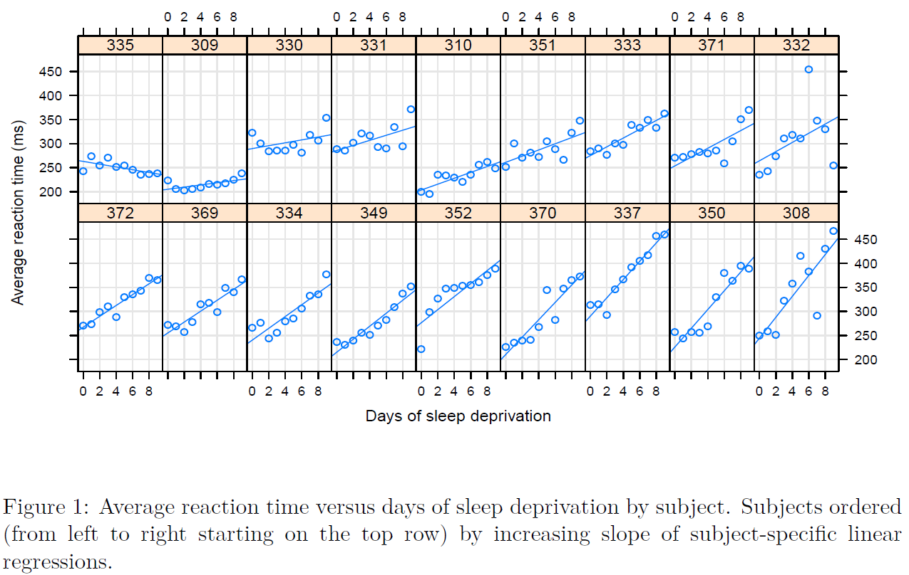

# Introduction
```{r setup, message=FALSE}
knitr::opts_chunk$set(echo = TRUE)
```


## The data

**(Fictitious data)**

ERP experiment

- 20 Subjects,
- 6 Channels: O1, O2, PO7, PO8, P7, P8
- Stimuli: pictures. Conditions:
    * 1 (f): fear (face)
    * 2 (h): happiness (face)
    * 3 (d): disgust (face)
    * 4 (n): neutral (face)
    * 5 (o): object (face)
- Measure: Area around the component P170

Setting parameters, importing the data:
```{r,warning=FALSE,message=FALSE}
# 
# # example of files contents:
# # s01 NC P7 f -7.1121
# # s01 NC P7 h -7.2582
# # s01 NC P7 d -7.4540
# # s01 NC P7 n -5.6729
# # s01 NC P7 o -2.1812
# # s01 NC PO7 f -7.4169
# 
# 
# library(readr)
# library(dplyr)
# 
# dati=lapply(datafiles, read_delim,col_names = FALSE ,delim = " ")
# dati=bind_rows(dati)
# str(dati)
# names(dati)=c("Subj","Group","Chan","Condition","Y")
# 
# # Not used in this analysis
# dati$Group=NULL
# dati$Subj=factor(dati$Subj)
# dati$Chan=factor(dati$Chan)
# dati$Condition=factor(dati$Condition)
# str(dati)
# save(dati,file="datiEEG.Rdata")
# 
# dati2=subset(dati,(Chan=="O1")&(Condition%in%c("f","n")))
# dati2$Condition=factor(dati2$Condition)
# save(dati2,file="dati2EEG.Rdata")
load("./dataset/datiEEG.Rdata")
load("./dataset/dati2EEG.Rdata")

dati$Condition=factor(dati$Condition,levels=c("o","d","f","h","n"))

# VERY IMPORTANT:
contrasts(dati$Chan) <- contr.sum(6)
contrasts(dati$Condition) <- contr.sum(5)
contrasts(dati$Subj) <- contr.sum(nlevels(dati$Subj))

contrasts(dati2$Condition) <- contr.sum(2)
contrasts(dati2$Subj) <- contr.sum(nlevels(dati2$Subj))

```

## Motivation (EDA)

For Channel `O1`:

```{r}
library(ggplot2)
p <- ggplot(subset(dati,Chan=="O1"),aes(Condition,Y))
p+geom_point(size = 3) +geom_boxplot(alpha=.1)
```

Is there a specificity of the subject?

```{r}
dati01=subset(dati,Chan=="O1")
library(ggplot2)
p <- ggplot(dati01,aes(Condition,Y))
p+geom_point(aes(group = Subj, colour = Subj))+
  geom_line(aes(group = Subj, colour = Subj))+
   geom_boxplot(alpha=.1)
```

We subtract the subject-specific effect (i.e. subject's mean) to each observation.

```{r}
dati01=subset(dati,Chan=="O1")
Y=scale(matrix(dati01$Y,5),scale=FALSE)
dati01$Y=as.vector(Y)

library(ggplot2)
p <- ggplot(dati01,aes(Condition,Y))
p+geom_point(aes(group = Subj, colour = Subj))+
  geom_line(aes(group = Subj, colour = Subj))+
   geom_boxplot(alpha=.1)
```

The dispersion of the data has been largely reduced.
This effect is the one taken in account by the models for repeated measures.

# Repeated Mesures ANOVA
## Introduction

wiki reference:
<https://en.wikipedia.org/wiki/Repeated_measures_design>

A nice explanation can be found (in particular see 7.9 and 7.10):   
Jonathan Baron (2011) Notes on the use of R for psychology experiments and questionnaires
<https://www.sas.upenn.edu/~baron/from_cattell/rpsych/rpsych.html>

and in the Course materal of   
ST 732, Applied Longitudinal Data Analysis, NC State University
by Marie Davidian
<https://www.stat.ncsu.edu/people/davidian/courses/st732/notes/chap5.pdf>
from <https://www.stat.ncsu.edu/people/davidian/courses/st732/>

## 2 conditions, paired observations
Let consider the reduced problem: channel `Chan=="O1`  and `Condition=="n"` or `Condition=="f"`.

How to compare the two conditions?
First try:
```{r}
t.test(dati2$Y[dati2$Condition=="n"],
       dati2$Y[dati2$Condition=="f"])
```
Is it ok?

NO! We don't take in account the fact that measures are taken on the same subject!

```{r}
t.test(dati2$Y[dati2$Condition=="n"],
       dati2$Y[dati2$Condition=="f"],paired=TRUE)
## equivalent to
t.test(dati2$Y[dati2$Condition=="n"]-
         dati2$Y[dati2$Condition=="f"])
```

Can you write it as a linear model?

```{r}
mod2=lm(Y~ Condition+Subj,data=dati2)
anova(mod2)
```

Compare the results. (Different or the same?)

## Linear models with repeated measures
Let's consider (and fit) a linear model with `Chan*Condition`:

```{r}
modlmf=lm(Y~ Chan*Condition,data=dati)
anova(modlmf)
```

We don't take in account the fact that measures are taken on the same subject!

Can we just add the `Subj` term?

```{r}
modlmf=lm(Y~ Chan*Condition+Subj,data=dati)
anova(modlmf)
```

Answer:  yes and no.  
The estimates are ok, but we need to take care of the residuals SS in the testing step.

All the SS that we need can be found in the saturated linear model. We compute them now and we use them later. 

```{r}
modlmf=lm(Y~ Chan*Condition*Subj,data=dati)
anova(modlmf)
```

## Repeated measures

```{r}
# The standard way
mod=aov(Y~ Chan*Condition+Subj + Error(Subj/(Chan*Condition)),data=dati)
summary(mod)
```


A better output and slightly more compleate analysis (Sphericity Corrections):

```{r}
library(ez)
mod=ezANOVA(dv=Y, wid=Subj, within=.(Chan,Condition),data=dati,type=3)
print(mod)

```

To see the relation between repeated measures and linear model, again, the Baron material is a good start. Specially see section "7.9.3  The Appropriate Error Terms"

## Spend your DF in a different way!
Same number of DF, but spent in a different way

```{r}
dati$Lateral=dati$Chan
levels(dati$Lateral)
levels(dati$Lateral)[c(1,3,5)]="Left"
levels(dati$Lateral)[-1]="Right"
levels(dati$Lateral)
contrasts(dati$Lateral) <- contr.sum(2)

dati$ChanL=dati$Chan
# https://en.wikipedia.org/wiki/Regular_expression
# Digits: \d
(levels(dati$ChanL)=gsub("\\d","",levels(dati$ChanL)))

contrasts(dati$ChanL) <- contr.sum(3)
```


```{r}
# The standard way
# mod=aov(Y~ ChanL*Lateral*Condition+Subj + Error(Subj/(ChanL*Lateral*Condition)),data=dati)
# summary(mod)
# 

library(ez)
mod=ezANOVA(dv=Y, wid=Subj, within=.(Condition,Lateral,ChanL),data=dati,type=3)
print(mod)
```

```{r}
ezPlot(dv=Y, wid=Subj, within=.(ChanL,Lateral,Condition),data=dati,
       x=Condition,split=ChanL,row=Lateral)

```

## Sphericity
Sphericity is an assumption about the structure of the covariance matrix in a repeated measures design. Before we describe it, let's consider a simpler (but more strict) condition.

**Compound symmetry**

Compound symmetry holds true
when the variances within conditions are equal (this is the same as the homogeneity of variance
assumption in between-group designs) but also when the covariances between pairs of conditions
are roughly equal. As such, we assume that the variation within experimental conditions is fairly
similar and that no two conditions are any more dependent than any other two.

Provided the observed covariances are roughly equal in our samples (and the variances are OK too) we can be pretty confident that compound symmetry is not violated.

compound symmetry is met when the correlation between `Condition f` and `Condition h` is equal to the correlation between `Condition f` and `Condition o` or `Condition h` and `Condition n`, etc (same for any other factor within subject, such as `Chan`). But a more direct way to think about compound symmetry is to say that it requires that all subjects in each group change in the same way over trials. In other words the slopes of the lines regressing the dependent variable on time are the same for all subjects. 
Put that way it is easy to see that compound symmetry can really be an unrealistic assumption. 


**Is compound symmetry met in our data?**

```{r}
# install.packages("GGally")
library(GGally)
Y=matrix(dati$Y,byrow = TRUE,nrow = 20*5)
Y=data.frame(Y)
names(Y)=levels(dati$Chan)
ggpairs(Y,aes(colour = dati$Condition[1:100], alpha = 0.4))
```

Not really! (correlations do often differ)

**Sphericity**  

Although
compound symmetry has been shown to be a sufficient condition for conducting ANOVA on
repeated measures data, it is not a necessary condition. Sphericity is a less restrictive form of
compound symmetry. Sphericity refers to the equality of variances of the differences between
treatment levels. If you were to take each pair of treatment levels, and calculate the differences
between each pair of scores it is necessary that these differences have equal variances.


We can check sphericity assumption using the covariance matrix, but it turns out to be fairly laborious. Remember that  variance of differences can be computed as:
$$S^2_x-S^2_y = S^2_x +S^2_y - 2S_{xy}$$


Further reading:
<https://en.wikipedia.org/wiki/Mauchly%27s_sphericity_test>

<!-- and a Video:   -->
<!-- Part 1: <https://www.youtube.com/watch?v=8BvlRJeCIaM>   -->
<!-- Part 2: <https://www.youtube.com/watch?v=bUXdWUHJRqA> -->
<!-- vedi anche:  https://www.google.com/url?sa=t&rct=j&q=&esrc=s&source=web&cd=&ved=2ahUKEwiQ4b-TtrPvAhWJO-wKHZ2rB4wQFjABegQIAhAD&url=http%3A%2F%2Foak.ucc.nau.edu%2Frh232%2Fcourses%2FEPS625%2FHandouts%2FRM-ANOVA%2FSphericity.pdf&usg=AOvVaw2AjUDNrV5Yn7zbplgBWLYq -->
This is often an unrealistic assumption in EEG data (spatial location of channel relates to correlation between measures)

## (Further) Limitations of Repeated Measures ANOVA

- (Design and) Data must be balanced
- Repeated Measures Anova doesn't allow for missing data (e.g. subjects/condiction/channel cells)
- It only handle factors, no quantitative variables

Mixed model is a more flexible approach.

# Mixed models

## Motivation/Introduction

```{r out.width = "700px",echo=FALSE}

```


```{r message=FALSE,echo=FALSE}
par(mfrow=c(1,3))
voidplot <- function(title){
  plot(0,0,col=0,xlim=c(0,1),ylim=c(0,1),xlab="X",ylab="Y",asp=1,main=title)
  abline(0,1,lwd=3)
}
voidplot("one for all")
voidplot("subject-specific intercept")
intrc=rnorm(5)/3
intrc[5]=-sum(intrc[-5])
for(i in 1:5) abline(intrc[i],1,lwd=2,col=i+1,lty=2)

slopes=rnorm(5)/3
slopes[5]=-sum(slopes[-5])
voidplot("subject-specific intercept + slope")
for(i in 1:5) abline(intrc[i],1+slopes[i],lwd=2,col=i+1,lty=2)
```

Mixed models allow for more flexible modelization.

I assume you are expert on mixed models, if not
<https://en.wikipedia.org/wiki/Mixed_model>   
and much more on:
<http://webcom.upmf-grenoble.fr/LIP/Perso/DMuller/M2R/R_et_Mixed/documents/Bates-book.pdf>  
and  
<https://cran.r-project.org/web/packages/lme4/vignettes/lmer.pdf>


## The model
Models with random effects can be defined as:
$$Y_{n\times 1} = X_{n\times p} B_{p\times 1} + Z_{n\times q} b_{q\times 1} + \varepsilon_{n\times 1}$$

where $$\varepsilon\sim\mathcal{N}( 0,\sigma^2 I_n)$$

In the models we will consider, the random effects are modeled
    as a multivariate normal random variable:
    $$b\sim\mathcal{N}(0,\Sigma_{q\times q}),$$

In a *linear mixed model* the conditional distribution $(Y|\mathcal B=b)$ is    a *spherical* multivariate Gaussian.


In our case $n=\#Subjects \times \#Conditions \times \#Channels=20\times 5 \times 6 = 600$.
$X$ is the matrix of (dummified) predictors. 
$Z$ can take many dimensions and values. Examples follow.

**Random Intercept (for each Subject)**

$Z$ is the matrix of dummy variables of the column `dati$Subj`.

```{r message=FALSE}
library(lmerTest)
# library(lme4)
contrasts(dati$Lateral)=contr.sum
contrasts(dati$ChanL)=contr.sum
contrasts(dati$Condition)=contr.sum

mod=lmer(Y~ Condition*Lateral*ChanL +(1|Subj),data=dati)

car::Anova(mod)
```


**Random Channel (for each Subject)**

Actually, instead of `Channel`, we use the combination of `ChanL*Lateral`. Same prediction ability (6 channels in Channel and 3X2 combination of ChanL and Lateral), just a different point of view.

$Z$ is the matrix of dummy variables of the column `dati$Chan`.

```{r}
contrasts(dati$Chan)<- contr.treatment
mod2=lmer(Y~ 1+Lateral*ChanL*Condition +(0+Chan|Subj),data=dati)
summary(mod2)

car::Anova(mod2)

# More flexible, but harder to fit (note that independence among random effects is imposed):
# mod3=lmer(Y~ Condition*ChanL+Lateral+(0+Lateral|Subj)+(0+Condition|Subj)+(0+ChanL|Subj),data=dati)
# 
```

**NOTE** the warning message. Not a good sign, actually. We don't discuss it in this lab. However, one should either, find out a different algorithm or change the model. Remember that the results of a model's fit that doesn't converge, can not be trusted!

**Random Emisphere (for each Subject)**

A simplified model may be based on Left/Right random effect for each subject.

$Z$ is the matrix of 2 dummy variables from the column `dati$Lateral` (intercept is not inclued in the random part of the model).


```{r}
mod3=lmer(Y~ Lateral*ChanL*Condition +(1+Lateral|Subj),data=dati)
summary(mod3)

car::Anova(mod3)

```


## Plotting tools

for the first model:
```{r message=FALSE}
library(effects)
plot(allEffects(mod))

#plot random effects:
require(lattice)
qqmath(ranef(mod, condVar=TRUE))
```

The second model:
```{r,message=FALSE}
library(effects)
plot(allEffects(mod3))

#plot random effects:
require(lattice)
qqmath(ranef(mod3, condVar=TRUE))

# scatter plot
ggpairs(ranef(mod3, condVar=TRUE)$Subj)
```

An alternative plotting tool:

```{r message=FALSE}
library(sjPlot)
library(ggplot2)
plot_model(mod3, type = "pred", terms = c("Condition", "ChanL","Lateral"))
```


## Validity of the assumptions


* Independence of the residuals?
* Normality of the residuals?
* Homoscedasticity of the residuals (i.e. same variance between subject/channel/condition)?
* outliers?

* Leaverage? (influential observations)

Please, do not test for normality, for homoscedasticity, sphericity etc. 

Use Exploratory data Analysis, instead!


```{r}
dati$residuals=residuals(mod3)
p <- ggplot(dati, aes(x=Chan, y=residuals,fill=Condition)) +   geom_boxplot()
p

p <- ggplot(dati, aes(x=Subj, y=residuals,fill=Condition)) +   geom_boxplot()
p
```

## Contrasts and post-hoc

### Post-hoc
```{r}
library(multcomp)
summary(glht(mod3, linfct = mcp(Condition = "Tukey")))
```

### Custom contrasts
An example:   

- neutral vs object in O1 (left)
- disgust vs neutral in O1 (left)
- fear vs neutral in O1 (left)
- happy vs neutral in O1 (left)

```{r}
library(multcomp)
ncoeff=length(coefficients(mod3)[[1]])
contr <- rbind("n - o" = c(0,0,0,0,-1, 0, 0, 0, rep(0,ncoeff-8)),
               "d - n" = c(0,0,0,0, 0, 1, 0, 0, rep(0,ncoeff-8)),
               "f - n" = c(0,0,0,0, 0, 0, 1, 0, rep(0,ncoeff-8)), 
               "h - n" = c(0,0,0,0, 0, 0, 0, 1, rep(0,ncoeff-8)))
compa= glht(mod3, linfct = contr)
summary(compa, test = adjusted("none"))

# with multiple comparisons
summary(compa)
```


# Multivariate ANOVA (MANOVA)

## Motivation
Hei, wait a moment... the trials for `object` condition are much more than any other condition, the variance of its estimated component must be (much?) lower, homoschedastcity doesn't hold!!

Let's use a different approach
Reshape the data from `long` to `wide` format.

to simplify the example, let's consider the comparison between conditions `neutral` vs `object`.

## Reshaping the data

Let' now compute the vectors of contrasts (one vector of reach channel, length equal to number of subjects): `Happy vs Neutral`

```{r}
Y=matrix(dati$Y,byrow = TRUE,nrow = 20)
colnames(Y)=paste(dati$Condition,dati$ChanL,dati$Lateral,sep = "_")[1:30]
```


```{r}
colnames(Y)
contr=matrix(0,30,6)
contr[c(2,4),1]=c(1,-1)
contr[c(2,4)+5,2]=c(1,-1)
contr[c(2,4)+10,3]=c(1,-1)
contr[c(2,4)+15,4]=c(1,-1)
contr[c(2,4)+20,5]=c(1,-1)
contr[c(2,4)+25,6]=c(1,-1)

dim(contr)
head(contr)


Yhn=Y%*%contr
colnames(Yhn)= levels(dati$Chan)
dim(Yhn)
```

What we see in O1?

```{r}
boxplot(Yhn[,1],col=2)
abline(0,0)
```

Same test as above, but under a different model
```{r}
t.test(Yhn[,1])
```

We can run the analysis over all channels
```{r}
(uni_t=apply(Yhn,2,t.test))
```

## Manova

```{r}
plot(Yhn[,1:2],pch=20)
abline(v=0)
abline(h=0)
points(mean(Yhn[,1]),mean(Yhn[,2]),cex=3,col=2,pch=20)
```

Manova test, overall among all channels:   
$H_0$ neutral=object in ANY of the channels.
<https://en.wikipedia.org/wiki/Multivariate_analysis_of_variance>
<https://en.wikipedia.org/wiki/Hotelling%27s_T-squared_distribution>
```{r}
modman <- manova(Yhn ~ 1)
anova(modman)
# equivalent to anova(modman,manova(Yhn ~ 0))
```

Assumptions: multivariate normality

```{r}
ggpairs(data.frame(Yhn))
```

Not so bad, actually.


# Mapping results on a scalp

```{r message=FALSE}
# install.packages("eegkit")
library(eegkit)

# plot 2d cap without labels
eegcap("10-20", plotlabels = FALSE)


# get the t-statistic for each channel:
t_chan=sapply(uni_t,function(chan)chan$statistic)
names(t_chan)=gsub("\\.t","",names(t_chan))

# match to eeg coordinates
data(eegcoord)
cidx <- match(names(t_chan),rownames(eegcoord))

# # plot t-stat in 3d
#  open3d()
# eegspace(eegcoord[cidx,1:3],t_chan)

# plot t-stat in 2d
eegspace(eegcoord[cidx,4:5],t_chan,cex.point = 3,colorlab="t-statistic",mycolors=heat.colors(4))

```

I suggest you to play with much nicer plots (based on library `ggplot2`):  
- package eeguana <https://github.com/bnicenboim/eeguana>  
- package eegUtils <https://github.com/craddm/eegUtils>


# (minimal) Bibliography

Jonathan Baron (2011) Notes on the use of R for psychology experiments and questionnaires
<https://www.sas.upenn.edu/~baron/from_cattell/rpsych/rpsych.html>

and Course materal of   
ST 732, Applied Longitudinal Data Analysis, NC State University
by Marie Davidian
<https://www.stat.ncsu.edu/people/davidian/courses/st732/notes/chap5.pdf>
from <https://www.stat.ncsu.edu/people/davidian/courses/st732/>

The bridge between rep meas. ANOVA and Mixed Models is built and developed by (very nice job (!), by the way):

<https://jaromilfrossard.github.io/gANOVA/>

<https://jaromilfrossard.github.io/gANOVA/articles/spherical-distribution-example.html>

<https://arxiv.org/abs/1903.10766>

About Type I, II, III SS:    <https://mcfromnz.wordpress.com/2011/03/02/anova-type-iiiiii-ss-explained/>

About Mixed models:   
<http://webcom.upmf-grenoble.fr/LIP/Perso/DMuller/M2R/R_et_Mixed/documents/Bates-book.pdf>  
and  
<https://cran.r-project.org/web/packages/lme4/vignettes/lmer.pdf>
