# Introduction

You find Rmd file and all materials at <http://livioivil.github.io/students/Teaching_material.html>

```{r setup, include=FALSE}
library(knitr)
knitr::opts_chunk$set(echo = FALSE,fig.align='center',out.width = "700px")

options(tinytex.verbose = TRUE)
```

## Biblio

-   J Ashburner, K Friston, W Penny (2003) Human Brain Function - 2nd Ed. Academic Press (preprint online: <https://www.fil.ion.ucl.ac.uk/spm/doc/books/hbf2/>)
    -   [SPM14] Chapter 14: An introduction to Random Field Theory. Brett M., Penny W. and Keibel S.
    -   [SPM15] Chapter 15: Developments in Random Field Theory. K.J. Worsley
-   [L] Lazar, Nicole A. (2008) The statistical analysis of functional MRI data. Springer
-   [PMN] Russell A. Poldrack, Jeanette A. Mumford, Thomas E. Nichols. (2011) Handbook of functional MRI data analysis. Cambridge
-   Friston, Holmes, Polin, Price and Frith (1996). Detecting Activations in PET and fMRI: Levels of Inference and Power. Neuorimage

<!-- ---- -->

-   Goeman & Solari (2014) Tutorial in biostatistics: multiple hypothesis testing in genomics. Statistics in medicine

-   MRC - Cambridge University: <http://imaging.mrc-cbu.cam.ac.uk/imaging/PrinciplesRandomFields>

-   wiki <http://en.wikipedia.org/wiki/Random_field>

The following material is largerly borrowed by:

-   <https://warwick.ac.uk/fac/sci/statistics/staff/academic-research/nichols/presentations/ohbm2012/Nichols_Thresholding.pdf> (New and best-practice approaches to thresholding. by T. Nichols)
-   <https://fsl.fmrib.ox.ac.uk/fslcourse/lectures/feat2_part2.pdf> (FSL Course by FSL Group)
-   <http://www.sbirc.ed.ac.uk/cyril/SPM-course/Talks/2015/10_multiple%20testing.pdf> (Cyril Pernet)

## Thresholding

```{r}
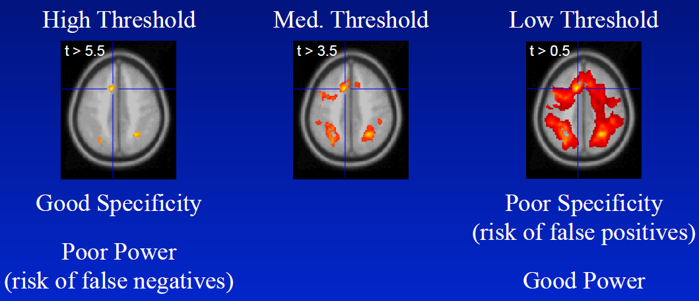
```

## Motivation

*Bennett et al. (2012)*

```{r}
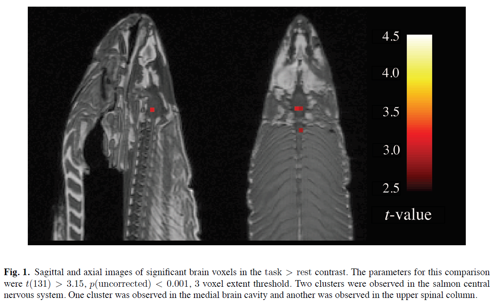
```

We need a method that ensures a fixed, high Specificity (i.e. low type I error) and as much Power it can.

# FamilyWise Error Rate

## FamilyWise Error Rate (FWER)

**Probability of AT LEAST one false rejection**

$$
\begin{aligned}
    \mathrm{FWER} =\alpha &= P \big(p_i \leq \widetilde{\alpha}\ \textrm{for at least one true null hypothesis} \big) \\
    &= \mathrm{P} \Big( \bigcup_{i\in \{true\ null\ hypos\}} \{p_i \leq \widetilde{\alpha}\} \Big) \\
\end{aligned}
$$

Procedure:

-   Fix $\alpha$ (usually $\alpha=.05$ or $.01$)
-   Compute $\widetilde{\alpha}$
-   Derive the threshold $u$ from $\widetilde{\alpha}$ (e.g. for $z$-scores: $u_{\widetilde{\alpha}}=\Phi^{-1}(1-\widetilde{\alpha})$)

## Sidak Correction

If one want to control (the probability of) $FWER$ at level $\alpha$, what is the the $\widetilde{\alpha}$-level to be used for each test?

When the $m$ tests are **independent** (or with some form positive dependence):

$$
\begin{aligned}
    \mathrm{FWER}= \alpha &= P \big(p_i \leq \widetilde{\alpha}\ for\ at\ least\ one\ true\ null\ hypo \big) = \\
    &= \mathrm{P} \Big( \bigcup_{i\in \{true\ null\ hypos\}} \{p_i \leq \widetilde{\alpha}\} \Big) =\\
    &= 1 - \mathrm{P} \Big( \bigcap_{i\in \{true\ null\ hypos\}} \{p_i > \widetilde{\alpha}\} \Big) = \\
    & (de Morgan)\\
    &= 1 - (1- \widetilde{\alpha})^{m_0}\ \ (m_0= \textrm{numb of true null hypos}) \\
    & (\textrm{we don't know $m_0$, but we know that $m_0\leq m$})\\
    &\geq 1 - (1- \widetilde{\alpha})^{m} 
\end{aligned}
$$

## Sidak Correction

Hence:

$$
\begin{aligned}
    1- \alpha &= (1- \widetilde{\alpha})^{m} \\
    (1- \alpha)^{1/m} &= (1- \widetilde{\alpha}) \\
  \widetilde{\alpha} &= 1- (1- \alpha)^{1/m} 
\end{aligned}
$$

So, we define $\widetilde{\alpha} = 1- (1- \alpha)^{1/m}$

Declare Active all voxles with statistic $z \geq u_{\widetilde{\alpha}}$ ($m =$ number of hypotheses)

Unfortunately, this solution is valid only when the p-values are INDEPENDENT (or have a positive dependence).

In most cases, tests have a dependence induced by the original variables.

## Bonferroni

**FWER**: Probability of AT LEAST one false rejection:

**Bonferroni**: $\widetilde{\alpha} = \alpha/m$

Declare Active all voxles with statistic $z \geq u_{\widetilde{\alpha}}$ ($m =$ number of hypotheses)

FWER under control:

$$
\begin{aligned}
\mathrm{FWER} & =  P \big (p_i \leq \alpha / m \textrm{ for at least one True null hypo} \big) \\
& =  P \Big (\bigcup_{i \in \{\textrm{true null hypotheses}\}} \{p_i \leq \alpha / m \} \Big) \\
& \leq  \sum_{i \in \{\textrm{true null hypotheses}\}} \mathrm{P} (p_i \leq \alpha / m) \\
&(m_0=\#\{\textrm{true null hypotheses} \})\\
& \leq m_0 \frac{\alpha}{m} \leq \alpha
\end{aligned}
$$

<!-- ---- -->

**Pros**

-   Very easy
-   Control the FWER under any dependence

**Cons**

-   Conservative (Adj. P-values very high, few rejections)

<!-- ## Holm (step-wise) -->

<!-- Holm S. (1979) A simple sequentially rejective multiple test procedure.*Scandinavian Journal of Statistics*; 6 (2): 65-70. -->

<!-- Holm uniformly improves Bonferroni (i.e. always equal or more rejections). -->

<!-- **Holm's sequential procedure** -->

<!-- 1. First step: adjusted p-value: $p \cdot m$; reject any hypo with $p_i \leq \alpha$ -->

<!-- 2. After $r$ rejections, adjusted p-value: $p \cdot (m-r)$ -->

<!-- 3. repeat 2 until you do not reject anything more. -->

# False Discovery Rate

## False Discovery Rate (FDR)

```{r, out.width=400}
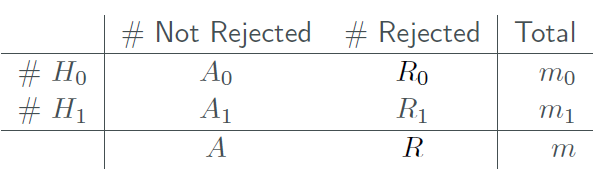
```

To control the **False Discovery Rate (FDR)** means defining a procedure s.t. $$ \textrm{mean}( \frac{\#  False\ Rej.s}{\# Rej.s} ) = \textrm{mean}({\frac{R_0}{R}} ) \leq \alpha$$

usually $\alpha=.05$

Remark: $FWER= P({\frac{R_0}{R}}>0 ) \leq \alpha$

*Benjamini and Hochberg (1995). Journal of the Royal Statistical Society, Series B (Methodological) 57 (1): 289--300.*

## BH procedure

-   Find the largest sorted p-value such that $p_{(k)} \leq \frac{k}{m}\alpha$ ($m =$ number of hypotheses)
-   Define $\widetilde{\alpha} = p_{(k)}$
-   Declare Active all voxles with statistic $z \geq u_{\widetilde{\alpha}}$

```{r, out.width= 500}
set.seed(1)
library(ggplot2)
n=10
dati=data.frame(Rank=1:n,p.values=sort(pnorm(-rnorm(n,2))))

atild.rank=max(which(dati$p.values<=dati$Rank/n*.05))
atild=dati$p.values[atild.rank]

p=ggplot(dati, aes(x=Rank, y=p.values)) + geom_point()
p+ geom_abline(intercept = 0, slope = .05/n,col="red")+
geom_point(aes(x=atild.rank, y=atild), colour="red",size=4)
```

## A toy example

```{r}
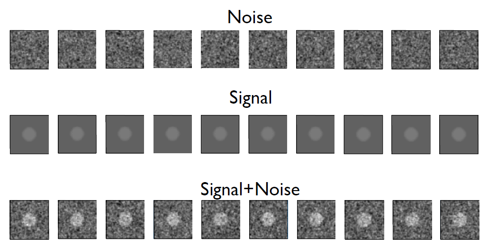
```

<!-- ---- -->

```{r sim_es2}
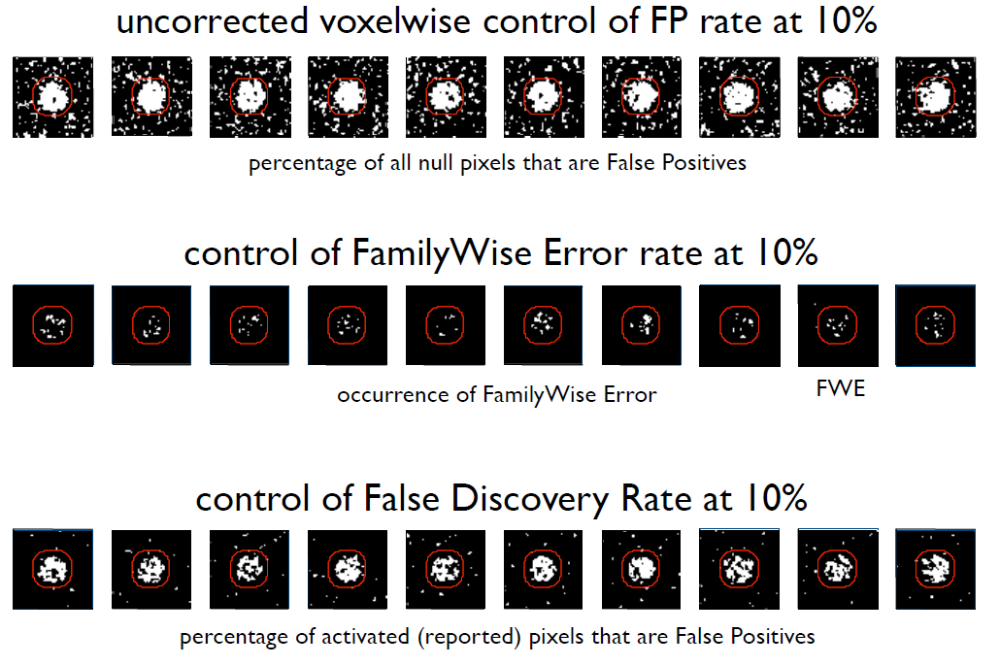
```

## FDR with Dependent tests

BH is valid under assumption of independence between the p-value and **Positive Regression Dependency** on each subset of true null hypos\
(eg normal with positive correlation)

Usually valid in fMRI data

For ANY dependence: **BY**

*Benjamini Y, Yekutieli D. (2001) The control of the false discovery rate in multiple testing under dependency. Annals of statistics 29 (4): 1165-1188*

But usually very conservative (sometimes more than Bonferroni)

## FWER or FDR?

**Assumptions implied by FDR**\
The assumptions are exchangeable:\
True Rejections can compensate False Rejections

I don't think that the FDR is adequate in fMRI data.

**Problems**

-   Cheating
-   Subsets

<!-- ---- -->

**Cheating** I can add not interesting hypotheses with significant with p-values to compensate false rejections.

**Subsets**\
FDR control does NOT imply control of FDR in all subsets\
eg: I correct all the tests, while discussing only those that I know how to better explain.

-   FDR control on all subsets = FWER control
-   FWER control on all subsets = FWER control

*Finner H, Roters M. (2001) On the false discovery rate and expected type I errors. biometrical Journal; 43 (8): 985-1005*

## Subsets of Rejections

```{r fdr_cheating}
include_graphics("./figs/fdr_cheating_red.png")
```

<!-- ```{r tik,engine='tikz',fig.ext='svg',fig.width=3} -->

<!-- \begin{tikzpicture}[scale=2.5] -->

<!-- \draw[rotate=60,thick] (0,0) ellipse (1cm and 2cm); -->

<!-- \path (-1,1) node {All hypos}; -->

<!-- \draw[rotate=30,thick, black!50!red] (.5cm,0) ellipse (.3cm and .5cm); -->

<!-- \path[black] (.1,.5) node {Rejections}; -->

<!-- \draw[rotate=00,thick, black] (.5cm,.1) ellipse (.2cm and .2cm); -->

<!-- \path[black] (.7,.2) node {False Rejections}; -->

<!-- \path[black] (1.2,1.2) node {Overall $\frac{\#\ False\ Rejections}{\#\ Rejections}= 0.10$}; -->

<!-- \path[black] (1.2,1) node {but in the subset??}; -->

<!-- \draw [rotate=40,green,thick] (-1.3, -.6) rectangle (1.3,0); -->

<!-- \path [green] (1.5,.5) node {Subset}; -->

<!-- \end{tikzpicture} -->

<!-- ``` -->

# Three levels of inference in neuroscience

## Levels of inference

-- Voxel-level\
-- Cluster-level\
-- Set-level

## Voxel-level Inference

```{r}
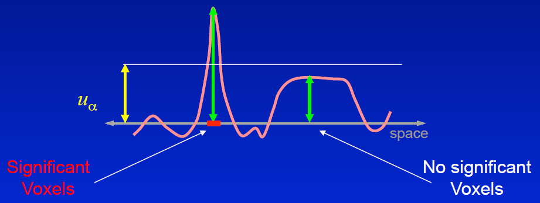
```

-   Retain voxels above $\alpha$-level threshold $u_\alpha$
-   Gives best spatial specificity:
    -   The null hyp. at a single voxel can be rejected

## Cluster-level Inference

```{r}
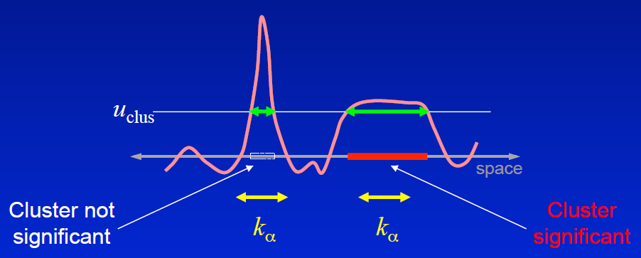
```

-   Typically better sensitivity

-   Worse spatial specificity

    -- The null hypo of entire cluster is rejected\
    -- Only means that AT LEAST ONE voxels in cluster active

## Set-level Inference

-   Count number of blobs $c$
    -   Minimum blob size $k$
-   Worst spatial specificity
    -   Only can reject global null hypothesis
    -   just a global inference, same as weak control

# Voxel-level Inference

## Do you Bonferroni... or not?

As we know, we test each hypothesis (voxel) at level: $\widetilde{\alpha} = \alpha/m$

In fMRI, we use more often $t$-threshold (or $z$-threshold, $F$-threshold, $\chi^2$-threshold -- similar results hold) instead of $p$-values and $\alpha$.

$p\leq \widetilde{\alpha}$ Equivalent to $t\geq t_{1-\widetilde{\alpha}}$

We look for the distribution of $Max-T$ (maximum t-statistic for $m$ test under $H_0$).

## Smoothed Images - Autocorrelation

```{r}
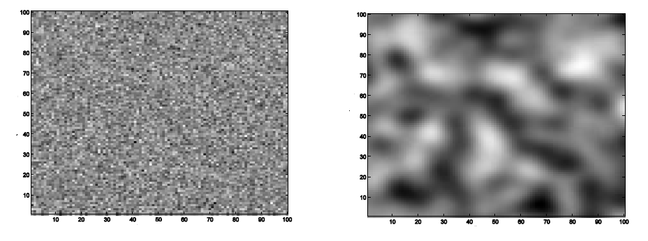
```

<!-- ---- -->

**Intrinsic smoothness**\
-- MRI signals are aquired in k-space (Fourier space); after projection on anatomical space, signals have continuous support\
-- Diffusion of vasodilatory molecules has extended spatial support

**Extrinsic smoothness**\
-- Re-sampling during preprocessing\
-- Deliberate additional smoothing to increase SNR\
-- Robustness to between-subject anatomical differences

Unfortunately, the spatial correlation makes Bonferroni correction too conservative

## RESEL

**RESEL** stands for **RES**olution **EL**ement

A RESEL is simply a block of pixels that is the same size as the FWHM.

Eg: 10 voxels, 2.5 FWHM, 4 RESELS

```{r,out.width="600px"}
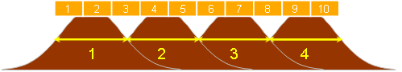
```

-   Number of RESELS is similar to, but NOT equal to, the number of independent observations in an image
-   The number of resels depends only on the number of pixels, and the FWHM
-   Smoothness (FWHM) can be estimated from standardized residuals.

## Max-T distribution

We know there is some function of the number of Resels, $R$, that describes the Max-t distribution

We don't know how to calculate it

But there is an approximation of the tail, and that is what matters.

This approximation is derived from Random Field Theory (RFT) Theory

## Random Field Theory

```{r,out.width="400px"}
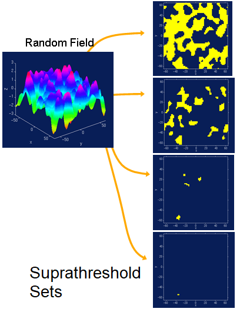
```

<!-- ---- -->

**Euler Characteristic** $\chi_u$ can be thought of as the number of blobs in an image after thresholding.

-- Topological Measure: #blobs - #holes\
-- At high thresholds, just counts blobs $$
\begin{aligned}
  FWER &= P(Max-t\geq u\ |\ H_0)\\
       &= P(One\ or\ more\ blobs\ |H_0)\\
  (no\ holes) &\approx P(\chi_u\geq 1|H_0)\\
       &\leq E(\chi_u|H_0)
\end{aligned}
$$

e.g. for Gaussian test statistic (i.e. $z$, not $t$): $$E(\chi_u|H_0)\approx R 2\pi^{-2}W^{-3} u^{2} exp(-u^2/2)$$

$R$ is the number of resels, $W$ is a function of the volume, $u$ is the z-score threshold

## How it works

-   First we estimate the smoothness (spatial correlation) of our statistical map.
-   Then we use the smoothness values in the appropriate RFT equation, to give the expected EC at different thresholds.
-   This allows us to calculate the threshold $u$ at which we would expect 5% of equivalent statistical maps arising under the null hypothesis to contain at least one area above threshold.
-   All hypos (voxels) with $t\geq u$ are rejected and FWER is controlled.

# Cluster-level inference

## Spatial extent - motivation

**Peak extent** (voxel-level)

We see a t-value of 10. It is so surprising (under the null hypothesis) that we have to reject it (i.e. $t$-statistic larger than $u_\alpha$).

**Spatial extent** (cluster-level)

We threshold the t-map at $u_{clust}=2.3$ (arbitrary threshold) and look at the spatial extent of clusters.

We see 300 connected voxels all with t-values $\geq u_{clust}=2.3$.

It is so surprising (under the null hypothesis) that we have to reject it (i.e. size of the cluster larger than $k_\alpha$).

## Cluster-level Inference

Two step-process:\
-- Define clusters by arbitrary threshold $u_{clus}$\
-- Retain clusters larger than $\alpha$-level threshold $k_\alpha$

```{r}
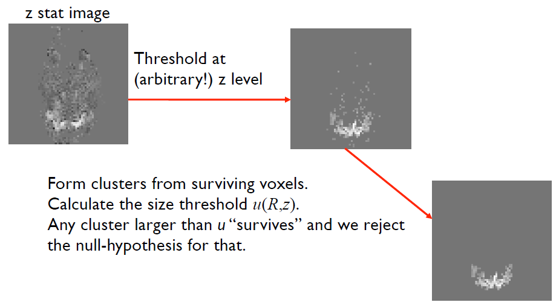
```

<!-- ---- -->

If we reject any cluster we will reject the largest.

We need the distribution of the largest cluster (given a threshold $u_{clust}$), under the null-hypothesis.

$k_\alpha$ is the $(1-\alpha)$-quantile of this distribution.

So, just as was the case for the $t$-values, we now have a distribution $f(R,u_{clust})$ that allows us to calculate a Family Wise threshold $k_\alpha$ pertaining to cluster size.

<!-- --- -->

$W=|\Lambda|^{-1/(2D)}=FWHM (4 log_e 2)^{-1/2}$, where $FWHM=FWHM_xFWHM_yFWHM_z$, $\Lambda$ is the covariance matrix of the field's first partial derivatives and $D$ is the number of dimensions (i.e. $D=3$)

At high thresholds, the number of clusters $\chi_u$ approximates the number of maxima and has been shown to have a Poisson distribution (Adler, 1981, Theorem 6.9.3, page 161): $$ P(\chi_u = c) \approx \lambda(c, E(\chi_u))$$

-   the expected number of maxima $E(\chi_u)$ (i.e., clusters) is: $$E(\chi_u)\approx R 2\pi^{-(D+1)/2}W^{-D} u_{clust}^{D-1} exp(-u_{clust}^2/2)$$

<!-- ---- -->

-   Distribution of the number of voxels $n$ in a cluster:\
    $$P(n \geq k) \approx exp (-\beta k^{2/D})$$, where $\beta = [\Gamma(D/2 + 1)E(\chi)/(S \Phi(-u))]^{2/D}$

The probability to observe a cluster with $k$ or more voxles is

$$P(u_{clust}, k) \approx 1 - exp (-E(\chi)P(n \geq k))$$ $k_\alpha$ is the $k$ such that $P(u_{clust}, k)=\alpha$.

<!-- ---- -->

$k_\alpha$ depends on the initial *cluster-forming* threshold $u_{clust}$.

```{r}
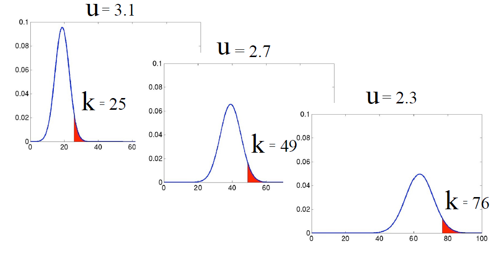
```

## Voxel/Cluster-level in a glance

```{r}
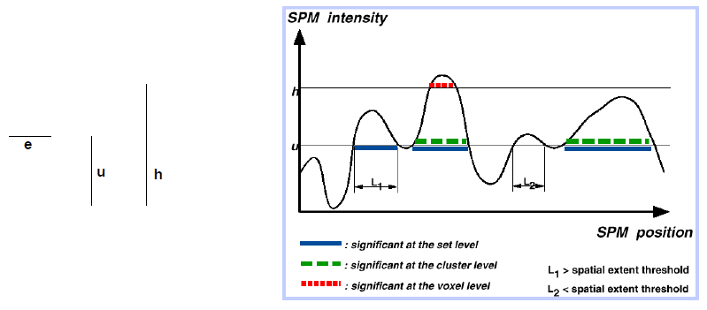
```

## Results $\alpha=.05$

```{r,out.height=600}
include_graphics("./figs/spm_results_fwer05.pdf")
```

## Results $\alpha=.01$

```{r,out.height=600}
include_graphics("./figs/spm_results_fwer01.pdf")
```

## Remarks

-   Needs a null-hypothesis, a test-statistic and an initial cluster forming threshold.
-   Calculates a (size) threshold based on number of RESELS and initial (z) threshold

**Pros**

-   Gives a (size) threshold such that the family-wise error is controlled.
-   Calculates that threshold very fast.

## Limitations

-   *Sufficient smoothness*
    -   FWHM smoothness $3-4\times$ voxel size (Z)\
    -   More like $\sim 10\times$ for low-df T images
-   *Smoothness estimate* is biased when images not sufficiently smooth
-   *Multivariate normality*: virtually impossible to check
-   Several layers of *approximations* (e.g. Lattice Image Data $\approx$ Continuous Random Field)
-   *Stationarity* required for cluster size results

This can be solved via permutation-approach

-   Inference pertains to entire cluster (i.e. there is at least one voxel)
    -   This can be solved via All-Resolution Inference approach
-   Initial threshold is arbitrary and must be chosen a priori
    -   This can be solved via All-Resolution Inference approach

(All-Resolution Inference, Rosenblatt et al. <https://www.ncbi.nlm.nih.gov/pubmed/30056198>)

... **A serious problem**, no jockes:\
Eklund, Nicholsd and Knutsson (2016) Cluster failure: Why fMRI inferences for spatial extent have inflated false-positive rates. PNAS
